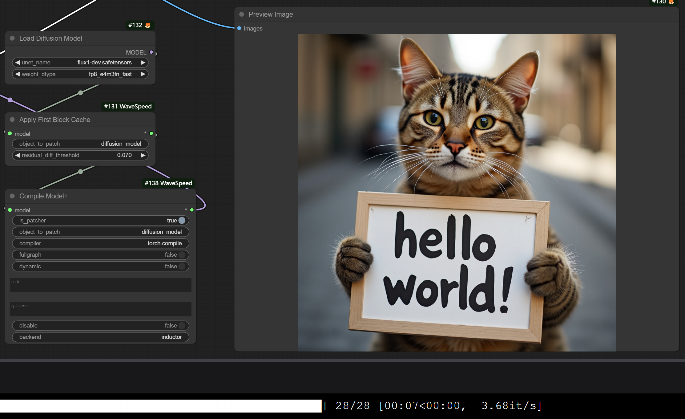
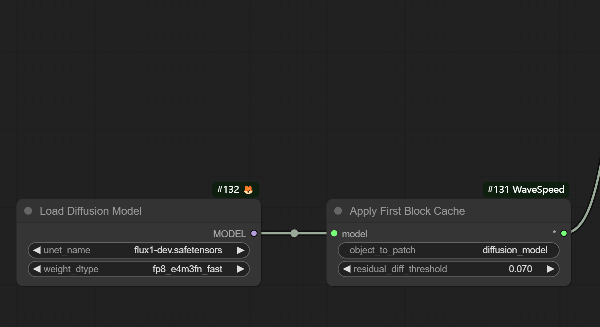

# Comfy-WaveSpeed

[WIP] The all in one inference optimization solution for ComfyUI, universal, flexible, and fast.

- [Dynamic Caching (First Block Cache)](https://github.com/chengzeyi/ParaAttention?tab=readme-ov-file#first-block-cache-our-dynamic-caching)
- Enhanced `torch.compile`

| FLUX.1-dev Original | FLUX.1-dev with First Block Cache and Compilation |
| - | - |
|  |  |

This is just launched, and we are working on it. Please stay tuned.
For any request or question, please join the Discord server.

[Discord Server](https://discord.gg/xtk6jUtYtr)

# Installation

```bash
cd custom_nodes
git clone https://github.com/chengzeyi/Comfy-WaveSpeed.git
```

# Usage

## Demo Workflow

You can find demo workflows in the `workflows` folder.

## Dynamic Caching (First Block Cache)

To use first block cache, simply add the `wavespeed->Apply First Block Cache` node to your workflow after your `Load Diffusion Model` node and adjust the `residual_diff_threashold` value to a suitable value for your model, for example: `0.07` for `flux-dev.safetensors` with `fp8_e4m3fn_fast`.
It is expected to see a speedup of 1.5x to 3.0x with acceptable accuracy loss.

It supports many models like `FLUX`, `LTXV` and `HunyuanVideo (native)`, feel free to try it out and let us know if you have any issues!



## Enhanced `torch.compile`

To use the Enhanced `torch.compile`, simply add the `wavespeed->Compile Model+` node to your workflow after your `Load Diffusion Model` node or `Apply First Block Cache` node.
The compilation process happens the first time you run the workflow, and it takes quite a long time, but it will be cached for future runs.
You can pass different `mode` values to make it runs faster, for example `max-autotune` or `max-autotune-no-cudagraphs`.

**NOTE**: `torch.compile` might not be able to work with model offloading well, you could try passing `--gpu-only` when launching your `ComfyUI` to disable model offloading.


# Others

## Use with `diffusers`

Please refer to [ParaAttention](https://github.com/chengzeyi/ParaAttention) for more information.
